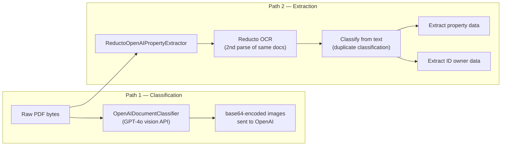
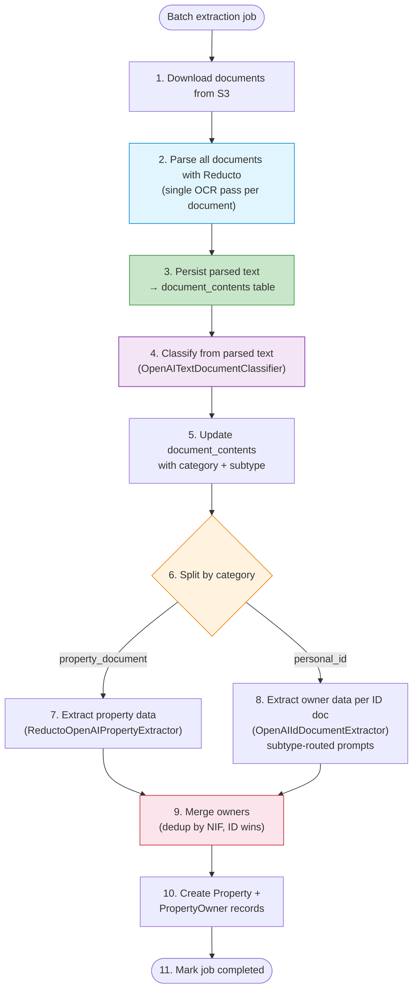
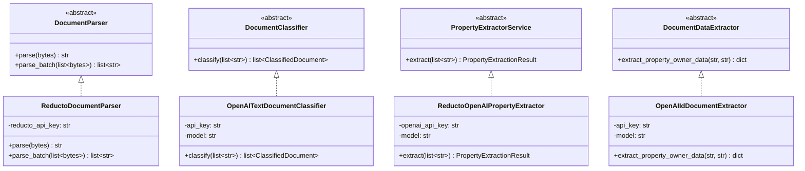
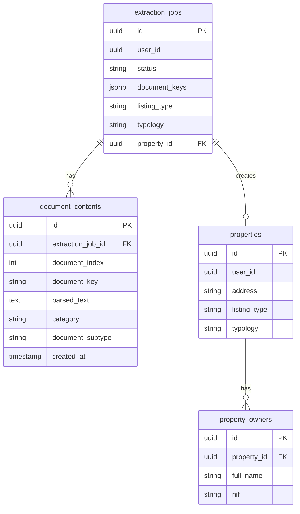
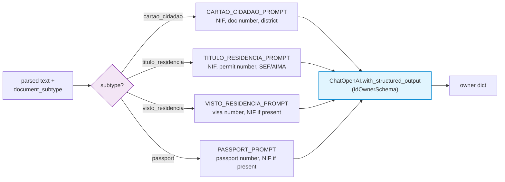
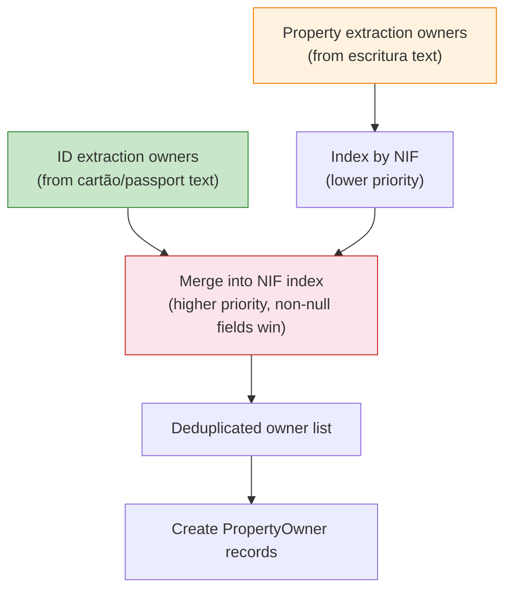

# ADR-001: Parse-first extraction pipeline — single OCR, text-based classification and extraction

**Date:** 2026-03-16
**Status:** Accepted

## Context

The original batch property extraction pipeline had a design problem: it used two separate classification paths and redundant OCR.

### Before (double-OCR design)

Problems:

1. **Double OCR** — Every document was parsed twice: once by OpenAI vision (base64 images) for classification, once by Reducto for text-based extraction. This doubled latency and API costs.
2. **No persistence of parsed content** — Reducto text was used in-memory and discarded. Re-processing a job required re-OCR'ing all documents.
3. **Monolithic extractor** — `ReductoOpenAIPropertyExtractor` (339 lines) did OCR + classification + property extraction + ID extraction + owner merging in one class, violating single responsibility.
4. **Two classification implementations** — `OpenAIDocumentClassifier` (vision-based, used by `ProcessBatchPropertyExtraction`) and `_classify_documents()` (text-based, internal to the extractor) both classified documents with different prompts and schemas.

### Cost analysis

| Operation | Old pipeline | New pipeline |
|-----------|-------------|-------------|
| Reducto OCR calls per document | 1 (extractor) | 1 (parser) |
| OpenAI vision API calls | N documents (classifier) | 0 |
| OpenAI text LLM calls | classification + property + N×ID | classification + property + N×ID |
| **Total API calls per batch of 5 docs** | **5 vision + 5 OCR + 7 LLM = 17** | **5 OCR + 7 LLM = 12** |

## Decision

### Parse all documents first, then classify and extract from text

The new design follows a strict linear pipeline: **parse → persist → classify → extract**.

### Split the monolith into focused classes

The 339-line `ReductoOpenAIPropertyExtractor` is decomposed into four single-responsibility classes:

### Persist parsed content

A new `document_contents` table stores the Reducto output for each document in a job:

### Port signature changes

All ports now accept **text** instead of **raw bytes**, making the OCR boundary explicit:

| Port | Before | After |
|------|--------|-------|
| `PropertyExtractorService.extract()` | `list[bytes]` | `list[str]` |
| `DocumentClassifier.classify()` | `list[bytes]` | `list[str]` |
| `DocumentDataExtractor.extract_property_owner_data()` | `(bytes, content_type: str)` | `(parsed_text: str, document_subtype: str)` |

The new `DocumentParser` port owns the bytes→text boundary:

| Port | Method | Signature |
|------|--------|-----------|
| `DocumentParser` | `parse()` | `(bytes) → str` |
| `DocumentParser` | `parse_batch()` | `(list[bytes]) → list[str]` |

### ID document subtype routing

`OpenAIIdDocumentExtractor` routes each ID document to a type-specific extraction prompt based on the classification result:

### Owner merge strategy

Owners from property documents (escrituras, certidões) are merged with owners from ID documents. The merge uses NIF as the join key, with ID extraction taking precedence for non-null fields:

Special cases:
- NIF `000000000` (placeholder for visas/passports without NIF) is never used as a merge key
- Owners without NIF are added as separate entries keyed by `_no_nif_{full_name}`

## Consequences

**Positive:**

- **Eliminates double OCR** — Each document is parsed exactly once, reducing latency and Reducto API costs
- **Eliminates vision API dependency** — Classification and ID extraction use text LLM calls instead of expensive GPT-4o vision calls, reducing OpenAI costs
- **Parsed content is persisted** — `document_contents` enables re-classification or re-extraction without re-OCR, supports debugging, and provides an audit trail
- **Single responsibility** — Each adapter class does one thing; easier to test, replace, or swap providers (e.g., replace Reducto with another OCR provider by implementing `DocumentParser`)
- **Text-based ports** — Downstream components are decoupled from the OCR provider; they only see strings

**Negative:**

- **More classes and files** — The monolith split adds 8 new files and 2 new ports; more surface area to navigate
- **Sequential parsing** — `parse_batch()` processes documents one at a time; could be parallelized with `asyncio.gather()` in a future iteration
- **Extra DB writes** — Persisting parsed content adds N inserts + N updates (for classification) per job; acceptable overhead for the audit/reuse benefit

## Files

| File | Role |
|------|------|
| `domain/models/document_content.py` | `DocumentContent` dataclass |
| `application/ports/document_parser.py` | `DocumentParser` ABC — bytes→text boundary |
| `application/ports/repositories/document_content_repository.py` | `DocumentContentRepository` ABC |
| `adapters/ai/reducto_document_parser.py` | `ReductoDocumentParser` — Reducto OCR |
| `adapters/ai/openai_text_document_classifier.py` | `OpenAITextDocumentClassifier` — text-based classification |
| `adapters/ai/openai_id_document_extractor.py` | `OpenAIIdDocumentExtractor` — subtype-routed ID extraction |
| `adapters/ai/reducto_openai_property_extractor.py` | `ReductoOpenAIPropertyExtractor` — property-only extraction from text |
| `adapters/persistence/supabase_document_content_repo.py` | `SupabaseDocumentContentRepository` |
| `adapters/database/models.py` | `DocumentContentModel` ORM model |
| `alembic/versions/a8c3d4e5f901_add_document_contents.py` | Migration |
| `application/use_cases/process_batch_property_extraction.py` | Rewritten pipeline orchestration |
| `application/use_cases/process_property_extraction.py` | Updated to parse-then-extract |
| `container.py` | Rewired with new dependencies |
| `shared/entrypoints/bootstrap.py` | Production adapter wiring |
