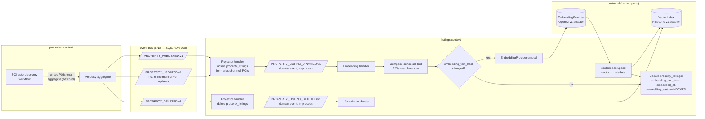
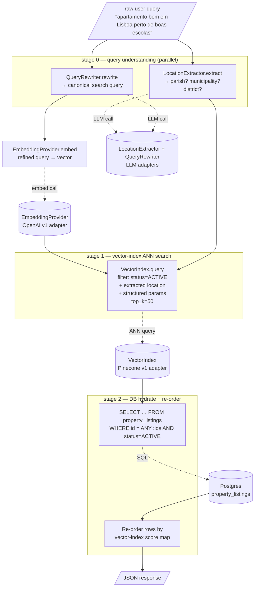

# ADR-013: Listing semantic search — provider-neutral vector index + two-stage retrieval

**Date:** 2026-05-09
**Status:** Accepted — v3 amends §2b (SNS-based dispatch, replacing v2's in-process choice) after the implementation spec surfaced an existing precedent. v3+ are non-architectural implementation refinements moving to `.claude/specs/active/`.
**Relates to:** Supersedes ADR-010 §"Semantic embedding" storage shape. ADR-010 defaulted to pgvector inside `property_listings`; this ADR moves the vector behind a `VectorIndex` port with **Pinecone as the v1 adapter**. All other parts of ADR-010 (POIs, cost-of-living, listing projector, event triggers) stand. This ADR also adds one new event contract: listings fires `PROPERTY_LISTING_UPDATED.v1` after each projection upsert (intra-context, in-process). It assumes properties' existing `PROPERTY_*.v1` events carry POIs as structured data in the snapshot — see §2a precondition.

## Context

ADR-010 sketched a semantic embedding for each listing, stored as a `vector(1536)` column on `property_listings` via pgvector, computed at projection time and queryable by cosine similarity at read time. The shape of that proposal is still right — embed the listing, search by query embedding — but three things have hardened since:

1. **Search is becoming the product surface, not a side experiment.** Product wants the public listing endpoint to answer free-text queries like *"apartamento bom em Lisboa perto de boas escolas"* and produce ranked results. That is a search application, not a "nearest-neighbor extension to a SQL filter."
2. **POIs migrated to the properties context.** Recent commits (`d5cfecfe1204`, `8e722fdfeebf`, `a06b74ff84d4`) moved POI catalogs and the auto-discovery workflow into `properties` — the listing-side enrichment ADR-010 sketched no longer owns POI storage. The embedding step needs to consume POIs from properties' carried-state snapshot, not produce them — and not synchronously read them back across the context boundary.
3. **Embedding belongs to listings, not the property event bus.** Whether a listing is in a state worth embedding is a listings-side decision (the projection succeeded, the row is queryable). Triggering embedding directly on upstream `PROPERTY_*` events conflates "the source aggregate changed" with "the projection committed in an embeddable state," and forces a cross-context callable port (`PoiSummaryReader`) to backfill data the projector already has in its hands. Moving the embedding trigger to a listings-owned domain event fired *after* the projection commits is cleaner — the projector becomes the single source of truth for "the listing is ready," and POIs flow into the projector via the upstream event snapshot rather than via a synchronous read-back.

The free-text-search ambition forces three decisions that pgvector doesn't make easy at our scale and ops surface:

- **Metadata-prefiltered ANN search.** "Listings near Lisboa, semantically close to the query" is metadata-filter-then-ANN, not pure cosine. pgvector can do this with a `WHERE …` predicate before the index scan, but performance is brittle as filters multiply, and our DBA budget is zero.
- **Independent scaling and cost.** Vector index growth shouldn't pin Postgres CPU. Search load shouldn't compete with operational read/write traffic against the same instance.
- **Hot reindexing on model bumps.** Every embedding-model upgrade needs a side-by-side namespace we can build, validate, then flip. Doing that in pgvector means a column rename + index rebuild on a live OLTP table.

Pinecone solves all three out of the box. We pay for it; in exchange we don't run a vector cluster.

The other forcing function is **search query understanding**. A user query like *"apartamento perto de boas escolas em Cascais"* contains:

- a typology hint (`apartamento`),
- a hard location filter (`Cascais`),
- a soft preference (`perto de boas escolas`).

A naïve `embed(query) → cosine search` collapses all three into a vector and lets ANN sort it out. That works poorly when the location is a hard intent: a perfectly-matching apartment near good schools in Lisboa should *not* outrank a less-perfect one in Cascais. We need to extract the location and use it as a hard prefilter, then let semantic similarity rank within the filter.

## Decision

### 1. Embedding storage moves behind a `VectorIndex` port — Pinecone is the v1 adapter

The vector is **not** stored in Postgres. It lives in an external vector index, accessed through a single port `VectorIndex` (defined in §6). The choice of backing store is an adapter detail; we ship Pinecone first, but the port's surface is intentionally a least-common-denominator across Pinecone / turbopuffer / pgvector / Qdrant / Weaviate so we can swap later without touching the listings domain or use cases.

The pgvector column proposed in ADR-010 is dropped from the plan. `property_listings` keeps **only metadata about the embedding**, not the vector itself:

| New column | Purpose |
|---|---|
| `embedding_text_hash` text nullable | SHA-256 of the canonical text fed to the embedder. Used to skip re-embedding when a `PROPERTY_UPDATED.v1` snapshot didn't change anything we embed. |
| `canonical_text_version` text nullable | The `LISTING_CANONICAL_TEXT_VN` schema version that produced the hash (e.g. `v1`). A schema bump (V1→V2) re-renders text differently for the same underlying data — without this column the hash alone can't distinguish "same data, new format" from "stale embedding under a model bump." Stored independently from `embedding_model_version` because the two evolve independently. |
| `embedding_model_version` text nullable | The model identifier the vector was built with (e.g. `openai:text-embedding-3-small`). Used to detect rows still on an old model after a bump. |
| `embedded_at` timestamptz nullable | Last successful upsert into the vector index. |
| `embedding_status` enum nullable | `PENDING` \| `INDEXED` \| `FAILED`. Cheap to query for ops dashboards (`WHERE embedding_status != 'INDEXED'`). |

The vector index holds the vector itself plus the structured metadata that enables stage-1 filtering (see §3).

### 2. Triggers — properties events drive the projection; a listings domain event drives the embedding

The embedding write is triggered by a **listings-owned domain event**, not by upstream property events directly. The flow runs through three stages:

#### 2a. Upstream property events (cross-context, SQS)

The listings worker subscribes to the existing properties events (see `src/listings/entrypoints/events_worker.py:67-70`). The projector handler runs on each and upserts (or deletes) the `property_listings` row. The properties events carry a **full property snapshot, including POIs as structured data** — listings does not synchronously read POIs from the properties context.

| Properties event | Projector handler action |
|---|---|
| `PROPERTY_PUBLISHED.v1` | Upsert `property_listings` row from the snapshot. |
| `PROPERTY_UPDATED.v1` | Upsert `property_listings` row from the snapshot. Fired on any property aggregate state change, including when the POI auto-discovery workflow writes POIs onto the aggregate. |
| `PROPERTY_DELETED.v1` | Delete `property_listings` row. |

**Properties-context contract preconditions** (out of scope for this ADR; properties owns the implementation):

1. `PROPERTY_*.v1` event payloads carry the property snapshot *with POIs as structured data* (categories, names, distances), not a pre-rendered summary string. Exact payload shape — max POI count per property, payload-size budget — lands in a properties-context spec.
2. The POI auto-discovery workflow **batches POI writes into a single property-aggregate update** and fires one `PROPERTY_UPDATED.v1` at the end of the workflow. Per-POI writes (one event per discovered POI) would cause N+1 redundant embed calls per listing during enrichment. The hash check would catch them, but the canonical text would change at every step, defeating the dedup. Properties is expected to coalesce.

#### 2b. Listings domain events — SNS-based dispatch (v3 amendment)

After each projector upsert/delete commits, the handler publishes a listings-owned domain event to SNS. The listings queue subscribes back to its own SNS topics; the dispatched handler runs on the same `SQSWorker`, same context, but on a fresh SQS message:

| Listings domain event | When published | Subscribers (v1) |
|---|---|---|
| `PROPERTY_LISTING_UPDATED.v1` | After a successful upsert of `property_listings`. Carries `property_id`. | Embedding handler. Future: search-side caches, denormalized projections, analytics. |
| `PROPERTY_LISTING_DELETED.v1` | After a successful delete of `property_listings`. Carries `property_id`. | Embedding handler. |

**v2 prescribed in-process dispatch.** The implementation spec (`2026-05-listing-semantic-search`) reversed that choice in v3 of this ADR after surfacing the existing precedent: `PROPERTY_LISTING_NEEDS_ADDRESS_ENRICHMENT.v1` already uses the same SNS pattern (see `src/listings/adapters/workers/property_event_handler.py:78-87`). The reasons to match the precedent rather than introduce a second mechanism:

- **Per-handler DLQ** (ADR-008 §6). An embedding failure DLQs only the embedding event; the row stays alive and the address-enrichment handler isn't blocked. With in-process dispatch, all handlers share a single redrive lifecycle on the upstream message.
- **Failure isolation across handlers.** A poisoned LLM call on the address path doesn't block the embedding pipeline and vice versa.
- **Single mechanism for listings-internal events.** Operators have one mental model for listings worker fan-out, not two.

Durability still rests on SQS redrive of the *upstream* property event: if the projector commits but the SNS publish fails, the next upstream redelivery re-runs the projector (idempotent upsert) and re-publishes (the embedding handler's hash check de-duplicates redundant embed calls). Publish failures are log-and-swallow on the projector side — same pattern as `NEEDS_ADDRESS_ENRICHMENT`.

A transactional outbox for listings domain events remains a future iteration if we ever need cross-process subscribers with stronger guarantees.

#### 2c. Embedding handler — driven by `PROPERTY_LISTING_UPDATED.v1` only

The embedding handler subscribes only to listings domain events, not to upstream property events. On `PROPERTY_LISTING_UPDATED.v1` it runs **two independent code paths**, both every time (not if/elif):

1. **Text path.** Recompute canonical text from the freshly-upserted `property_listings` row (which carries POIs from the upstream snapshot). If `(embedding_text_hash, canonical_text_version, embedding_model_version)` differs from the persisted tuple, re-embed and `VectorIndex.upsert`.
2. **Metadata path.** Recompute the metadata projection (notably `status`). If any value differs from the persisted projection, call `VectorIndex.update_metadata` (cheap; no embedding call).

Both paths exist because `status` is **not** part of `LISTING_CANONICAL_TEXT_V1` — a status flip from `ACTIVE` → `WITHDRAWN` doesn't change the text hash, but it must still propagate to the index so stage-1 filtering excludes the listing.

On `PROPERTY_LISTING_DELETED.v1`, the handler deletes the vector from the vector index by `listing_id`.

A failure in the embedding handler does not roll back the projection — it re-raises, the upstream SQS message redrives, the projector re-runs idempotently, the domain event re-dispatches, and the embedding handler retries. On terminal failure the row sits with `embedding_status='FAILED'` until ops investigates. The listing remains visible (it just won't be matched by semantic queries until indexed). Redrive is safe because the projector upsert is idempotent and the vector-index upsert is keyed on `listing_id`.

### 3. What we embed — `LISTING_CANONICAL_TEXT_V1` schema

Two pieces of data per listing: **the canonical text** (input to the embedder) and **the index metadata** (filterable fields stored alongside the vector). Both are versioned. Both are provider-neutral — every adapter that implements `VectorIndex` (Pinecone v1, turbopuffer / pgvector / Qdrant / Weaviate as future swaps) must accept these shapes.

**Ownership boundary** (locked in): the **embedding** — canonical-text composition, embedding model choice, vector index contents, and the `embedding_*` columns on `property_listings` — is a **listings-context concern**. **POIs remain in properties** (catalog, auto-discovery workflow, ground-truth storage); the listings context never imports `properties.PropertyPoi` or any POI table. Listings receives POIs as structured data inside the upstream property event snapshot (see §2a) and renders the `NEARBY:` line itself in the canonical-text composer. No cross-context callable port; no synchronous read-back from listings into properties. The canonical-text schema version is the only knob that gates POI formatting in the embedding.

#### 3a. Canonical text schema (`LISTING_CANONICAL_TEXT_V1`)

A **deterministic, labeled, line-oriented** rendering of the listing fields we want the vector to capture. Labels matter: the embedder is a sentence transformer, and `LOCATION: Cascais` retrieves better than the bare token `Cascais` floating in a blob.

```
LOCATION: <parish> · <municipality> · <district>
LISTING_TYPE: <SALE | PURCHASE>
TYPOLOGY: <HOUSE | APARTMENT | LAND | RUIN>
SIZE: <bedrooms> bed · <bathrooms> bath · <area_m2> m²
BUILT: <year_built> · energy <energy_rating>
PRICE: <price_eur> EUR
NEARBY: <poi_summary>
DESCRIPTION: <description, truncated to MAX_DESCRIPTION_CHARS>
```

The `<poi_summary>` field is rendered by the listings canonical-text composer from structured POI data carried in the upstream property event snapshot (POI categories, names, distances). The exact rendering rules — categories included, distance formatting, max POI count, ordering — land in v3 alongside the composition code; any change after v3 ships is a `LISTING_CANONICAL_TEXT_V2` bump.

**POI rendering invariants** (locked at v1; v3 picks the concrete format within these limits):

- **Deterministic ordering.** POIs sort by a stable total-ordered key (e.g. category → distance asc → name lex). Same POI input set ⇒ same rendered string, byte-for-byte. Required for hash stability.
- **Hard cap on POI count per listing** (default 20, configurable via `LISTING_POI_MAX_COUNT`). Bounds payload size and prevents tail POIs from drifting the hash on every minor enrichment update.
- **Distance-precision rounding** (default 100m). Micro-jitter from re-geocoding the same POI must not invalidate the hash.
- **Filter-before-render.** Excluded POIs (low confidence, categories outside the allowlist) are dropped from the input set *before* rendering, not after. The rendered string reflects the post-filter set.

**Composition rules** (locked; any change is a `LISTING_CANONICAL_TEXT_V2` bump):

1. **Field order is fixed** (above). Reordering changes embeddings → reordering = new schema version.
2. **Null/empty handling.**
   - For a **single-value line** (`LISTING_TYPE`, `TYPOLOGY`, `PRICE`, `NEARBY`, `DESCRIPTION`): if the value is null/empty, the entire `LABEL: …` line is omitted.
   - For a **composite line** (`LOCATION: parish · municipality · district`, `SIZE: bedrooms bed · bathrooms bath · area_m2 m²`, `BUILT: year_built · energy energy_rating`): null sub-fields are omitted **along with their preceding `·` separator**. Example: `parish=null, municipality="Lisboa", district="Lisboa"` → `LOCATION: Lisboa · Lisboa`. If **all** sub-fields of a composite line are null, the whole line is omitted (same as the single-value rule).
   - Either way, the goal is hash stability: a row whose sparse field stays null across updates produces the same canonical text byte-for-byte.
3. Whitespace inside a value is collapsed to single spaces; leading/trailing whitespace stripped.
4. `description` is truncated to `MAX_DESCRIPTION_CHARS` (default 2000) **measured in characters, not tokens** (deterministic + cheap). Suffix-clip; we accept the rare mid-sentence cut as the price of determinism. Token-budget check still applied at adapter boundary (text-embedding-3-small caps at 8191 tokens — way more than this schema can produce).
5. Currency in `PRICE` is `EUR` only (revisit when we list in other currencies).
6. Locale: PT today. The schema is locale-free — every listing renders the same regardless of viewer locale; the embedder is language-aware.
7. Line separator: `\n` (single LF). No trailing newline.
8. The full string is hashed with SHA-256 to produce `embedding_text_hash`. Hash equality across two events ⇒ skip re-embedding (and skip the vector-index upsert).

The composition function is a single pure function at `src/listings/application/services/canonical_text.py` — fully unit-testable, single source of truth.

#### 3b. Index metadata schema (`LISTING_INDEX_METADATA_V1`)

The structured fields stored next to the vector for stage-1 filtering. Provider-neutral typed dict — every `VectorIndex` adapter must support these as filter keys.

| Key | Type | Filter operators required |
|---|---|---|
| `listing_id` | UUID string | `eq` (also serves as the vector ID) |
| `property_id` | UUID string | `eq` |
| `organization_id` | UUID string | `eq` |
| `parish` | string (lowercased, trimmed) | `eq`, `in` |
| `municipality` | string (lowercased, trimmed) | `eq`, `in` |
| `district` | string (lowercased, trimmed) | `eq`, `in` |
| `listing_type` | enum `SALE` \| `PURCHASE` | `eq` |
| `typology` | enum `HOUSE` \| `APARTMENT` \| `LAND` \| `RUIN` | `eq`, `in` |
| `status` | enum `ACTIVE` \| `WITHDRAWN` \| `SOLD` \| `RENTED` \| `DRAFT` | `eq`, `in` |
| `price_eur` | numeric | `eq`, `gte`, `lte` (range) |
| `embedded_at` | ISO 8601 string | informational; not filtered on the read path |

Adapters MUST translate these operators to their native filter dialect — Pinecone uses Mongo-style operators, turbopuffer has its own filter language, pgvector uses SQL `WHERE` clauses. Adapters MAY support more operators internally; the port surface stays at this minimum so handlers + use cases never branch on which adapter is wired.

The listing payload (full description, image URLs, characteristics, etc.) is **not** stored as metadata. The vector index is for filter+rank; Postgres is for hydration (stage 2).

#### 3c. POI provenance — POIs arrive in the upstream event snapshot

POIs are not synchronously read from the properties context. They arrive in the `PROPERTY_*.v1` event payload — `PROPERTY_PUBLISHED.v1` and `PROPERTY_UPDATED.v1` both carry whatever POIs the property aggregate has at emit time. The POI auto-discovery workflow writes POIs onto the property aggregate and fires `PROPERTY_UPDATED.v1` (per §2a precondition 2, batched as a single update at the end of the workflow).

Two cases produce a POI-less embedding:

1. **Initial publish before enrichment.** A property published while POI auto-discovery is still running fires `PROPERTY_PUBLISHED.v1` with no POIs. The projector creates the row, emits `PROPERTY_LISTING_UPDATED.v1`, and the embedding handler embeds with `NEARBY:` omitted (per rule 2). When enrichment finishes, properties fires `PROPERTY_UPDATED.v1` with POIs, the projector re-upserts, the domain event re-fires, and the embedding handler re-embeds with POIs (canonical-text hash differs, so the no-op skip doesn't trigger).
2. **Properties without enrichment data** (e.g. legacy rows). The `NEARBY:` line is omitted permanently and the embedding ranks on the other fields.

The hash check makes case 1 cheap: two embed calls per listing across its enrichment lifecycle (one without POIs, one with), regardless of how many other `PROPERTY_UPDATED.v1` events fire in between.

### 4. Vector index topology — provider-neutral concepts, Pinecone v1 adapter

Topology decisions belong to the port surface, not the adapter. Every adapter we'd plausibly swap to (Pinecone, turbopuffer, pgvector, Qdrant, Weaviate) supports these concepts under a different name; we standardize on the conceptual names below and let each adapter translate.

| Concept | Port surface | Pinecone v1 mapping | turbopuffer mapping (future) | pgvector mapping (future) |
|---|---|---|---|---|
| **Vector ID** | string per upsert | Pinecone vector ID | turbopuffer document ID | PK column in the embeddings table |
| **Namespace** | string per call (per model version) | Pinecone namespace | turbopuffer namespace | dedicated table or `model_version` column |
| **Vector** | `list[float]` | dense vector | dense vector | `vector(N)` column (pgvector) |
| **Metadata** | `dict[str, Any]` per `LISTING_INDEX_METADATA_V1` | Pinecone metadata (40KB cap) | turbopuffer attrs | adjacent columns on the table |
| **Filter** | typed dict — `eq`, `in`, `gte`, `lte` | Mongo-style | turbopuffer filter language | SQL `WHERE` |
| **Distance metric** | declared at the adapter, not the port | cosine | cosine | `<=>` (cosine) |

Cross-cutting decisions (apply to every adapter):

- **Vector ID = `property_listing_id`** (UUID stringified). One listing → one vector. Idempotent upserts; deletes by ID.
- **Namespace = embedding model version**, e.g. `openai-text-embedding-3-small-v1`. A model bump means: build the new namespace from scratch via a backfill, validate offline, atomically flip a config pointer (`VECTOR_INDEX_NAMESPACE`), drop the old namespace. No downtime, no online rebuild — every candidate adapter supports this pattern under a different mechanism (Pinecone/turbopuffer namespaces; for pgvector, side-by-side tables that the adapter resolves by namespace string).
- **Cosine similarity** is the default metric. Adapters that don't natively cosine-normalize (pgvector before 0.5) must do it at upsert time.

**v1 adapter: Pinecone.** One index `listings-prod`, dimension 1536 for `text-embedding-3-small`. No code outside `src/listings/adapters/vector/pinecone_index.py` knows the word "Pinecone" — domain code, use cases, route handlers, and other adapters all talk to `VectorIndex`.

### 5. Search flow — two-stage retrieval

`GET /api/v1/listings/properties?q=…` (and structured filter params from ADR-010) becomes a multi-stage pipeline. The flow runs in parallel where possible to keep p95 under a search latency budget (target: < 800ms p95).

#### Indexing flow (write path — on publish / update / delete)



The projector handler runs on the upstream SQS message, commits the projection, then dispatches the listings domain event in-process. The embedding handler runs on that domain event in the same worker, in the same SQS-message lifecycle. Failure in the embedding handler re-raises and SQS redrives the upstream message; the projector re-runs idempotently and the embedding handler retries until success or terminal failure (`embedding_status='FAILED'`).

#### Search flow (read path — on `GET /api/v1/listings/properties?q=…`)



**Fallbacks that matter:**

- **Location extraction returns nothing** → skip the metadata location filter. The vector-index search runs with status + structured-filter constraints only; semantic rank carries the burden.
- **Location extraction confidence is low** (multiple candidates) → use the most-specific level returned (parish > municipality > district) and pass remaining candidates as a metadata `IN` filter, not a single-value match.
- **Query is empty** (`q` not provided) → skip stages 0–1 entirely, fall through to the existing structured-filter relational query from ADR-010 v1. Semantic search is a feature, not a requirement.
- **Vector-index request fails** → fall back to relational filtering with the location filter applied via SQL (`WHERE address ILIKE …`). Search keeps working, just less smart. Logged + alerted.

### 6. New ports in `src/listings/application/ports/`

Supporting types referenced by the ports below (sketches; concrete definitions land in v2 of this ADR):

```python
# Filter operators the port surface MUST accept; adapters translate to native dialect.
VectorFilter = dict[str, FilterOp]                  # key → operator
FilterOp = (
    {"eq": str | int | float}
    | {"in": list[str | int | float]}
    | {"gte": float} | {"lte": float}
    | {"and": list[FilterOp]}                       # composition
)

@dataclass(frozen=True)
class VectorMatch:
    id: str
    score: float
    metadata: dict[str, Any]

@dataclass(frozen=True)
class ExtractedLocation:
    parish: str | None
    municipality: str | None
    district: str | None
    confidence: float                               # 0.0 – 1.0; drives the low-confidence fallback
```

Ports:

```python
class EmbeddingProvider(Protocol):
    """Text → dense vector. Adapter: OpenAI."""
    async def embed(self, text: str) -> list[float]: ...


class VectorIndex(Protocol):
    """Provider-neutral vector store. Adapters: Pinecone (v1),
    turbopuffer / pgvector / Qdrant / Weaviate (future swaps).

    All operations take a `namespace` string — this is how we model
    "model version per index" across vendors. See §4.
    """

    async def upsert(
        self,
        vector_id: str,
        vector: list[float],
        metadata: dict[str, Any],
        namespace: str,
    ) -> None: ...

    async def delete(self, vector_id: str, namespace: str) -> None: ...

    async def update_metadata(
        self,
        vector_id: str,
        metadata: dict[str, Any],
        namespace: str,
    ) -> None: ...

    async def query(
        self,
        vector: list[float],
        filter: VectorFilter,        # typed dict: eq / in / gte / lte
        top_k: int,
        namespace: str,
    ) -> list[VectorMatch]: ...      # [(id, score, metadata), …] — ranked


class LocationExtractor(Protocol):
    """Raw query → optional parish/municipality/district. Adapter: LLM."""
    async def extract(self, query: str) -> ExtractedLocation: ...


class QueryRewriter(Protocol):
    """Raw query → canonical search-friendly query. Adapter: LLM."""
    async def rewrite(self, query: str) -> str: ...
```

POIs are not modeled as a port — they arrive as structured data in the upstream property event snapshot (see §2a) and are persisted on (or alongside) the `property_listings` row by the projector. The canonical-text composer reads them from there.

Test doubles ship for every port: in-memory `VectorIndex` (cosine over a Python dict — passes the same contract tests as Pinecone), rule-based `LocationExtractor` (regex-based for tests + as the fallback when LLM fails), and identity `QueryRewriter`.

`SearchListings` use case orchestrates the pipeline — calls stage 0 in parallel via `asyncio.gather`, then stage 1 against `VectorIndex`, then stage 2 against the existing `ListingRepository`. The use case does **not** import any adapter module; it sees only the ports.

### 7. Configuration (env vars)

```bash
# Embeddings
EMBEDDING_PROVIDER=openai
EMBEDDING_MODEL=text-embedding-3-small
EMBEDDING_DIMENSIONS=1536

# Vector index (provider-neutral selector + per-adapter blocks)
VECTOR_INDEX_PROVIDER=pinecone                          # pinecone | turbopuffer | pgvector | qdrant | weaviate
VECTOR_INDEX_NAMESPACE=openai-text-embedding-3-small-v1 # = embedding model version
VECTOR_INDEX_TOP_K=50
VECTOR_INDEX_REQUEST_TIMEOUT_SECONDS=5

# Pinecone v1 adapter (only read when VECTOR_INDEX_PROVIDER=pinecone)
PINECONE_API_KEY=...
PINECONE_INDEX=listings-prod

# Future adapters illustrate the swap shape — none implemented in v1
# TURBOPUFFER_API_KEY=...
# TURBOPUFFER_NAMESPACE_PREFIX=listings
# PGVECTOR_DSN=postgresql+asyncpg://...   # if vectors live in app DB

# Search-side LLMs (location extraction + query rewriting)
SEARCH_LLM_MODEL=gpt-...                          # picked at implementation time
SEARCH_LLM_MAX_OUTPUT_TOKENS=200
SEARCH_LLM_TIMEOUT_SECONDS=4

# Caching (optional v1) — keyed by raw query string
SEARCH_QUERY_CACHE_TTL_SECONDS=300
```

### 8. Cost & latency budget

**Per write (publish/update):**
- 1 embedding call (≈ 80–200ms p95 — network roundtrip dominates; fractions of a cent at `text-embedding-3-small` pricing).
- 1 vector-index upsert (≈ 30–80ms p95, sub-cent).
- Both skipped entirely when `(embedding_text_hash, canonical_text_version, embedding_model_version)` all match the persisted tuple.

**Per search:**
- 1 LLM call for location extraction (parallel) — budget 300ms p95.
- 1 LLM call for query rewriting (parallel) — budget 300ms p95.
- 1 embedding call — budget 150ms p95.
- 1 vector-index query — budget 100ms p95.
- 1 hydration SQL — budget 50ms p95.

Stages 0 run in parallel with each other; stage 1 waits on the slower of `(rewrite + embed)` (≈ 450ms) and `(location extract)` (≈ 300ms). Critical path = 450ms + stage 1 (100ms) + stage 2 (50ms) ≈ **600ms p95**, leaving ~200ms of headroom on the < 800ms end-to-end budget. If we miss it consistently, add an in-memory query cache (config block above) and revisit.

## Consequences

- **New paid dependency**: a managed vector index (Pinecone for v1). Operational surface (quota, region, latency dashboard) belongs to platform.
- **New LLM call sites on the read path.** Search-side LLMs are now load-bearing for p95. We need timeouts that *fail open* (skip the LLM stage and use the raw query) rather than block.
- **Embedding model choice is now a versioned namespace.** Bumping the model = new namespace + backfill + atomic config flip. Documented above; needs a backfill CLI under `src/listings/entrypoints/backfill_embeddings.py`.
- **Properties-context contract preconditions.** This ADR depends on two properties-side behaviors: (a) `PROPERTY_*.v1` event payloads carry POIs as structured data alongside the rest of the property snapshot; (b) the POI auto-discovery workflow batches its POI writes into a single property-aggregate update so it fires *one* `PROPERTY_UPDATED.v1` at the end of enrichment, not one per discovered POI. Both are properties-side decisions — listings does not write to properties' tables, and the listings code does not import `properties.PropertyPoi`. Exact payload shape is owned by properties (see Out of scope).
- **Listings domain events.** `PROPERTY_LISTING_UPDATED.v1` and `PROPERTY_LISTING_DELETED.v1` are intra-listings domain events with **in-process dispatch** in v1 — no outbox, no SQS round trip, single subscriber (the embedding handler). Durability rests on SQS redrive of the upstream property event; the projector and the embedding handler are both idempotent. A transactional outbox is a follow-up if we add cross-process subscribers.
- **Embedding state is best-effort.** A listing can be visible but un-indexed; the public structured-filter query still works. Ops dashboard query: `WHERE embedding_status IN ('PENDING','FAILED')`.
- **Two new infrastructure pieces** (the vector index itself + its initial namespace) provisioned via IaC. Local dev uses an in-memory `VectorIndex` adapter; LocalStack does not include Pinecone.
- **`property_listings` schema change** from ADR-010's plan: `embedding vector(1536)` is **out**, the five new metadata columns above are in (`embedding_text_hash`, `canonical_text_version`, `embedding_model_version`, `embedded_at`, `embedding_status`). Migration is additive. The row also needs to carry POI structured data (denormalized columns, JSONB blob, or an adjacent listings-side projection table) so the canonical-text composer can render `NEARBY:` without a cross-context read — exact storage shape lands in v4.

## Alternatives considered

1. **Stay with pgvector (ADR-010 v1).** Rejected: metadata-prefiltered ANN at our growth rate is operationally heavier than we want to run, and model bumps mean column rebuilds on a live OLTP table. Pinecone gives us namespaces and zero ops.
2. **Single-stage vector search (skip location extraction).** Rejected: location is a hard intent. Letting ANN rank "Lisboa apartments near schools" against "Cascais apartments near schools" produces the wrong order on real queries.
3. **Skip query rewriting; embed the raw query.** Rejected: real user queries are noisy ("um T2 jeitoso na zona de Lisboa", typos, mixed languages). Rewriting to canonical search vocabulary measurably improves retrieval; the user explicitly asked for it.
4. **Store the full listing payload in vector-index metadata** (skip DB hydrate). Rejected: metadata is for filtering, not for response payloads. Listing rows have prices, image URLs, characteristics that we don't want denormalized into a vector store at scale.
5. **Different vector store** (Qdrant, Weaviate, OpenSearch k-NN). Punted. Pinecone is the chosen v1; the `VectorIndex` port keeps a swap viable. Decision driver was operational simplicity, not benchmark wins.
6. **Embed in the projector itself** (no separate handler). Rejected: keeps the projector hot path on a paid external API and couples projection latency to OpenAI/Pinecone. Splitting handlers gives us per-handler DLQ (ADR-008) and lets the projector stay synchronous against the DB.
7. **Cross-encoder re-ranker** (e.g. send top-50 from the vector index through a small model that re-scores against the raw query). Punted to v6 — measurable wins but adds another LLM call to the read path and another budget to manage.
8. **Trigger embedding directly on upstream `PROPERTY_*` events** (this ADR's v1 design). Rejected: forces a cross-context callable port (`PoiSummaryReader`) for synchronous POI read-back, conflates "source aggregate changed" with "projection committed in an embeddable state," and gives the embedding handler two sources of truth (the upstream event + the synchronous POI read). v2 routes embedding through a listings-owned domain event fired after the projection commits; the projector becomes the single source of truth for embedding-readiness and POIs flow into it via the event payload.
9. **Separate `PROPERTY_ENRICHMENT_COMPLETED.v1` upstream event** for the POI-auto-discovery-finished signal. Considered for semantic clarity ("other contexts could react specifically to enrichment-done"). Rejected: enrichment writing POIs onto the property aggregate is *just* an aggregate state change, which is already exactly what `PROPERTY_UPDATED.v1` models. There is no current consumer that needs to distinguish "enrichment-driven update" from "any other update," and adding workflow-specific events without a consumer is speculative. The firing-frequency concern (one update per discovered POI vs. one update at end of workflow) is a properties-side workflow-batching choice, not a reason to introduce a separate event type. Revisit if a future consumer materializes that genuinely needs enrichment-specific semantics.

## Out of scope

- **Exact prompts** for `LocationExtractor` and `QueryRewriter` — implementation spec.
- **Backfill strategy** for existing `property_listings` rows — separate spec; one-shot CLI under `src/listings/entrypoints/backfill_embeddings.py`.
- **Vector-index sizing / tier / region** (Pinecone-specific for v1, but the question generalizes to whatever store we run) — infra spec.
- **Multilingual embeddings.** Listings are PT-dominant today. Revisit if EN/DE/FR listings grow.
- **Cross-encoder re-ranking** — v6.
- **Personalized search** (user history, saved filters). Out for v1.
- **Faceted result counts** ("how many results in each parish") — separate spec.
- **Search-side caching** beyond the optional in-memory query cache flagged in §7.
- **Properties-context payload shape.** POI structured-data schema, max-POI cap per property, payload-size budget for `PROPERTY_*.v1`. Owned by the properties context; this ADR depends on the contract but does not specify it.
- **Properties-context POI-write batching strategy** (how the auto-discovery workflow accumulates POIs and fires a single `PROPERTY_UPDATED.v1`). Properties-side concern; this ADR notes it as a precondition (§2a) but does not prescribe the implementation.
- **Transactional outbox for listings domain events.** In-process dispatch suffices for v1 (single subscriber, single worker). Revisit if we add cross-process subscribers.

## Iteration plan

This ADR is intentionally light. We iterate by adding:

- **v2:** listings owns its embedding trigger via an in-context domain event (`PROPERTY_LISTING_UPDATED.v1`); upstream `PROPERTY_*.v1` events carry POIs as structured data in their snapshots (POI auto-discovery batches its writes and fires a single `PROPERTY_UPDATED.v1` at the end); cross-context `PoiSummaryReader` port removed.
- **v3 (current):** §2b reversed from in-process dispatch to SNS-based dispatch after the implementation spec (`2026-05-listing-semantic-search`) surfaced the existing `NEEDS_ADDRESS_ENRICHMENT` precedent. Per-handler DLQ + failure isolation + single mechanism for listings-internal fan-out. Domain model types, canonical-text composer, and schema migrations also landed in this iteration via the implementation spec.
- **v4:** state-transition diagram for `embedding_status`, ops dashboard queries, alerting on `WHERE embedding_status = 'FAILED'` and on hot-loop indicators (≥3 indexed/listing/hour). Backfill CLI under `src/listings/entrypoints/backfill_embeddings.py` for pre-existing rows.
- **v5:** provider-adapter contract details (Pinecone request/response shapes, OpenAI embedding API shape, location-extraction + query-rewriting prompts) and failure-mode catalog.
- **v6:** cross-encoder re-ranker (if v3/v4 retrieval quality demands it).

Each iteration appends a section here and bumps the status. Once status flips to **Accepted**, we open the implementation spec under `.claude/specs/active/`.
